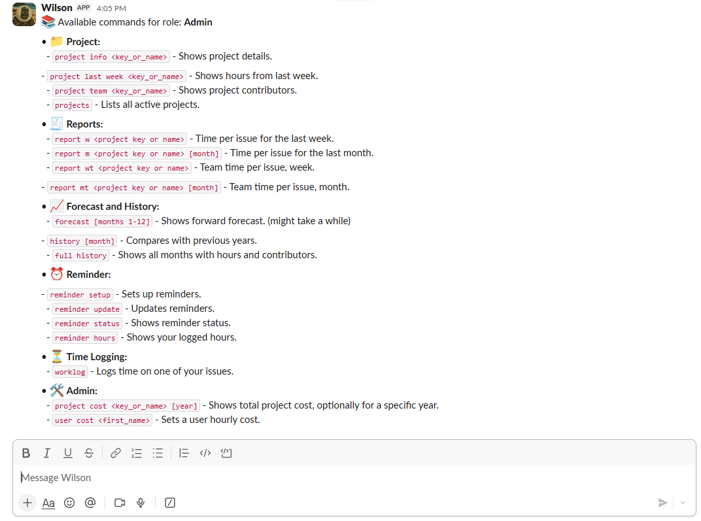

# Wilson

A powerful Slack bot that brings intelligence to your team's work management. Wilson connects Jira, Tempo, and AI-driven forecasting to automate time tracking, deliver real time workload analytics, and provide actionable insights, all from within Slack.

## What It Does

Wilson streamlines how teams manage work and time:

- **Time Tracking**: Log work hours and timesheets directly in Slack without context switching
- **Workload Forecasting**: Intelligent predictions based on historical project data help managers optimize resource allocation and plan sprints with confidence
- **Jira & Tempo Sync**: Seamless two-way synchronization keeps your issue tracking and time reporting in perfect alignment
- **Analytics Dashboard**: Visual insights into team productivity, workload distribution, and project timelines
- **Smart Reminders**: Proactive notifications keep your team accountable with timely prompts for time entries and worklog updates
- **Real-Time Reporting**: Generate comprehensive reports on project hours, team performance, and resource allocation

## Screenshots

